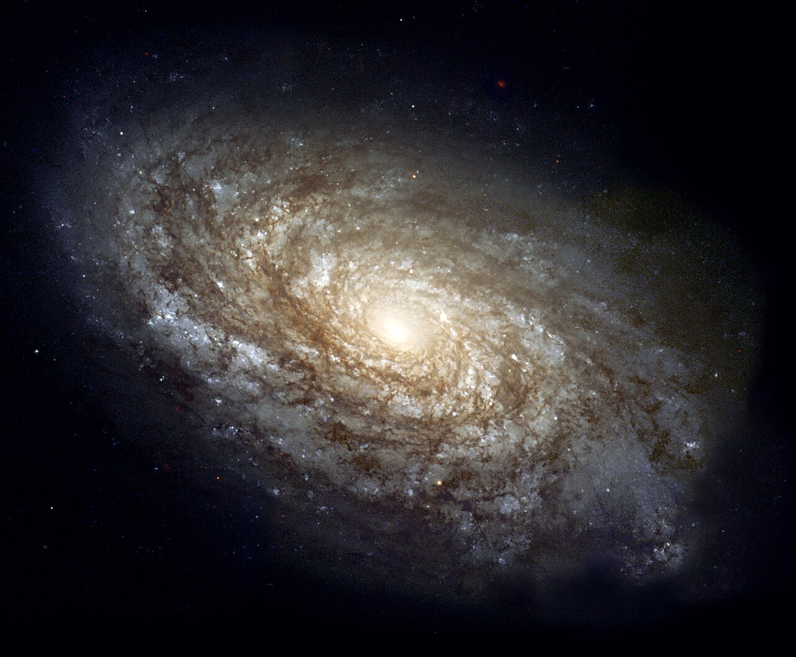

# gal.jpg image drawer

gal.jpg galaxy image code milky way source code (tags lol)

 

remake of above pic by me
you will need to download [processing](https://processing.org/) to run it. similiar to arduino ide

could not figure out original parameters, will need some tweaking
feels kinda off

copy of the code here too so google will index it lol

made this for her

```
PImage pic;

void setup(){
    size(1000, 1000);
    pic = loadImage("gal.jpeg");
}

void draw() {
    background(0);

    int mountX = 300;
    int mountY = 300;

    pic.resize(mountX, mountY);

    float w = (float) width / mountX;
    float h = (float) width / mountY;

    for(int i = 0; i < mountX; i++) {
        for(int j = 0; j < mountY; j++) {
            color c = pic.get(i, j);
            float bri = brightness(c);

            push();
            translate(i * w, j * h);
            if (bri > 80) {
                float conf = map(bri,
                0, 255,
                0, 1);
                fill(255);
                ellipseMode(CORNER);
                ellipse(0, 0, w * conf, h);
            }
            pop();
        }
    }
}
```
